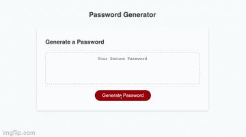

# Password-Generator project
This project was the third assignment in the bootcamp class. The purpose is to understand the functions within Javascript.

# Application
I didn't know where to start with this project.  We learned so much, so fast.  The web has so many sources to help you on this project. After watching video after video, looking at tons of blogs, and other examples the attempt commenced.

Through google exploration, I was introduced to new methods within the javascript realm.  
* User chooses between 8 and 128 characters
* Five different variables created on the basis of user choice
* User chooses Upper case, Lower case, Number, and Symbols
* All variables would be collected in a variable titled PasswordContent
* Confirm windows for selected variables
* For loops to generate code
* Push method to add new items to an array within the length due to choice by user
* math.floor method was used to select random characters due to users choice criteria in order to generate password.

# Technology 
Javascript, CSS, HTML

# Application In Use

# Links
* [https://github.com/Vinyl77/password-generator]
* [https://vinyl77.github.io/password-generator/]

 
